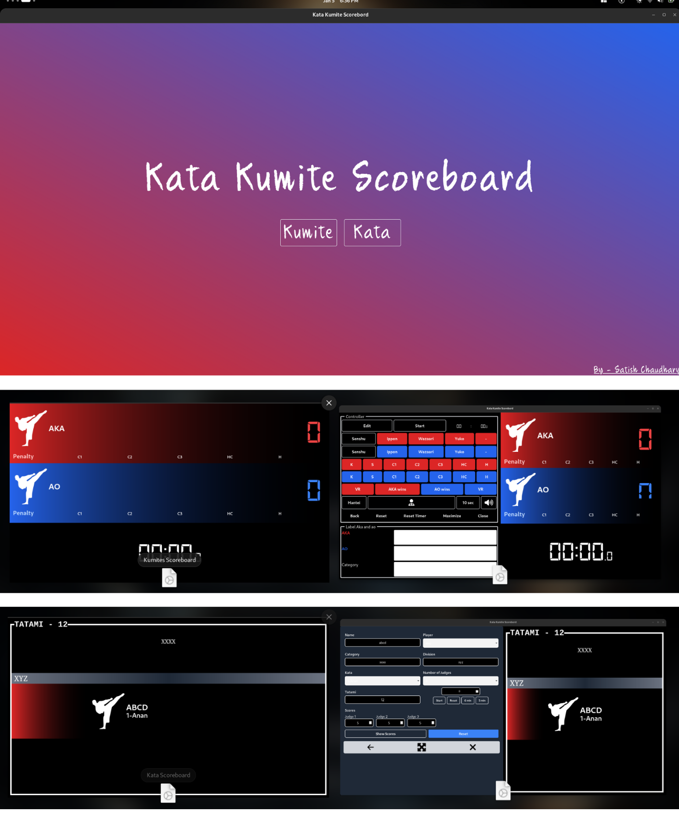

# Kata Kumite Scoreboard

This is a scoreboard application for Kata and Kumite matches. It is built with React, TypeScript, and Tauri.

## Screenshots



## Features

- [x] Kata and Kumite scoreboard
- [x] Timer

## Getting Started

These instructions will get you a copy of the project up and running on your local machine for development and testing purposes.

### Prerequisites

You need to have the following installed:

- [Node.js](https://nodejs.org/en/) (for React)
- [Rust](https://www.rust-lang.org/) (for Tauri)

### Installing

1. Clone the repository: `git clone https://github.com/Satishcg12/scorebord.git`
2. Navigate to the project directory: `cd scorebord`
3. Install dependencies: `npm install`

## Running the Application

To run the application in development mode, use the following command:

```sh
npm run dev
```

To build the application for production, use the following command:
```sh
npm run build
```


## Deployment

Add additional notes about how to deploy this on a live system.
Built With
- [React](https://reactjs.org/) - The web framework used
- [TypeScript](https://www.typescriptlang.org/) - The language used
- [Tauri](https://tauri.studio/) - The framework used to build the desktop application
- [NPM](https://www.npmjs.com/) - Dependency Management

## Authors

- **Satish Chaudhary** - _Developer_ - [Satishcg12](https://github.com/Satishcg12/)
    
## License

This project is licensed under the MIT License - see the [LICENSE.md](LICENSE.md) file for details
